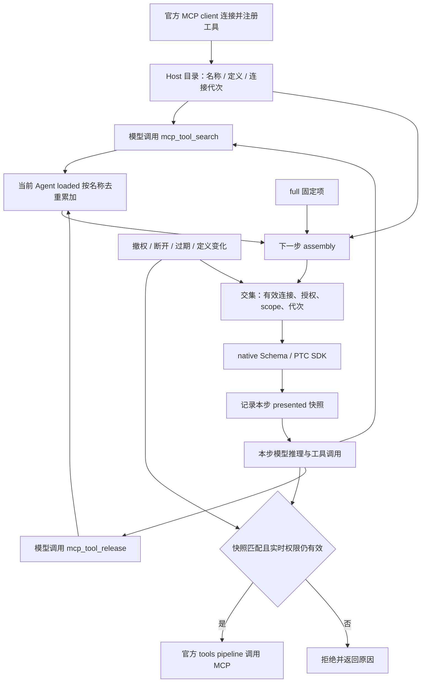

<!--
[INPUT]: 依赖 mcp-management-design.md 的字段/授权、Harness tools/system-prompt/credentials、platform-client 的公开原语。
[OUTPUT]: 定义连接与 OAuth 状态机、会话搜索/显式释放流程图、厂商机制对照、本步调用快照、PTC 兼容、并发/撤销、端侧路由和诊断契约。
[POS]: docs 的 MCP 端侧实施规格；不重新实现 MCP 协议、不把呈现过滤充作安全隔离。
[PROTOCOL]: 变更时更新此头部，然后检查 CLAUDE.md
-->

# MCP 端侧运行时详细设计

父设计：[mcp-management-design.md](mcp-management-design.md)。目标 Harness 0.1.7-alpha.1；旧 alpha.2/rc.2 探针证据不能代替目标版本验收。

## 1. 组件、依赖与作用域

MCP Runtime 是 `owndsh-plugin` 内部模块。实现时可以使用 `plugin/packages/mcp-runtime` 作为 workspace package 组织代码，但它只能由 `plugin/packages/bundle` 组合进唯一发布物 `owndsh-plugin`，不单独发布、安装、验签或出现在员工插件市场。代码包名不改变产品形态。

```text
bundle ── platform-client（平台认证与授权切片请求）
   └──── mcp-runtime
            ├─ 官方 dsh-mcp-client（连接与注册）
            ├─ MCP SDK auth helpers（OAuth）
            ├─ Harness credentials/settings（用户连接意愿与凭据）
            └─ Harness tools/systemPrompt（搜索、呈现、执行门禁）
ui ── 同源 MCP local API ── mcp-runtime
```

员工入口固定是 **OwnDsh 设置 → MCP** tab；它和账号、设备、受管插件等员工侧能力同属唯一的 `owndsh-plugin`，不新增顶级 sidebar、独立 MCP 插件设置页或宿主私有页面。企业管理员入口固定是同一 OwnDsh 产品的 Console `/mcp` 独立菜单，端侧 runtime 不复制组织管理事实。

平台请求只走 `EnterprisePlatformService.request`，不能把平台 Bearer 交给 OAuth/MCP URL。
OAuth 外部请求在 mcp-runtime 专用 auth HTTP 函数完成，不调用 platform.request；这是不同的认证边界，不给平台 HTTP 封装增加跨 origin 例外。

公开 `EnterpriseMcpRuntime` 提供 `status/list/catalog/connect/pause/disconnect/startOAuth/cancelOAuth/reconnect/reconcile/dispose`；方法由状态机约束，不暴露 token getter 或 arbitrary execute。
不为单实现另造通用插件工厂。bundle 以现有依赖注入端口连接 UI local API，platform-client 不反向 import mcp-runtime。

Host 共享：assignment map、client fiber、用户 credential、当前授权快照、受管工具目录。
每 agent 独立：下步 loaded 集合、本步 presented 快照；用 WeakMap<Agent,...>，同 session 恢复后产生新 Agent 则从冷态开始。搜索和执行分别读取下步集合与本步快照，不能把可变 loaded 直接当成本步执行许可。
上下文缺少 agent 时不返回受管 schema；Host 设置页用专门 status/catalog 方法，不依赖空 scope 的搜索工具。

单 Host 同时一个平台用户。当前 owner 为 `(platform origin, userId, deviceId, installationId)` 的 SHA-256；身份只取已校验的 `platform.bootstrap()`，serverId 另列入凭据键。当前数据库 `sys_user.user_id` 与 `ent_device.id` 都是全库主键，足以区分租户；不从 UI 接收 tenantId，也不凭客户端字段授权。如果未来改成租户内 ID，必须同步把服务端可信 tenantId 加入 owner。运行时另用 session generation 拒绝同身份重新登录之前的迟到任务。

## 2. 本地状态与凭据记录

### 2.1 非秘密 settings

复用官方 settings，命名 `owndsh.mcp`，记录版本1与身份键对应的 `{serverId,desiredConnected}`。
默认 desiredConnected=false；首次 CONNECT 显式变 true。NONE 也需点击连接。PAUSE 置 false 保留 credential；DISCONNECT 置 false 删除 credential。不存 URL/token、工具 schema 或 loaded 集合。

### 2.2 CredentialRecord

使用 `credentialKey('owndsh-mcp', 'c-' + sha256({ownerDigest,serverId,bindingDigest}))`；`c-` 满足官方 key segment 必须以小写字母开头的约束，所有私有数据放 `kind:'grant'` 的 opaque payload；不创建可被 UI 自动读取的通用 API Key reference。

```ts
type McpCredentialPayload = {
  version: 2
  ownerDigest: string
  serverId: string
  bindingDigest: string
  updatedAt: number
} & (
  | { kind: 'api-key'; apiKey: string }
  | { kind: 'oauth'; state?: { tokens?: StoredOAuthTokens; clientInformation?: StoredOAuthClientInformation } }
)
```

这是当前 `McpCredentialManager` 的持久记录；OAuth 分支只保存官方 SDK 的 `StoredOAuthTokens` 与 `StoredOAuthClientInformation`，不解释或改写 token、issuer、refresh 语义。MCP 尚未上线，只维护当前记录格式，存放于独立 `owndsh-mcp/` 凭据命名空间；连接意愿写入官方 bundle settings 的 `owndsh-plugin.mcp.desiredConnected`。

实际实现用 discriminated union，拒绝分支混用和未知字段。bindingDigest 是 URL/auth/公共 headers/transport 的稳定摘要；所有可能改变秘密发送目标的配置变化都使旧记录失效。
摘要使用 bundle `mcp-oauth.ts` 内部的 `canonicalizeJson`，对象键顺序不影响绑定；auth 的 issuer/resource/clientId/scopes/endpoints 全部参与摘要。不会对新 URL 尝试旧 Key，不仅按 serverName 存秘密。显示名/呈现/超时/reconnect/revision 变化不丢 OAuth。

SDK verifier 只在当前 `McpCredentialManager` 内存中保存，授权 code 和 discovery metadata 不由 OwnDsh 保存。官方 `auth()`、`StreamableHTTPClientTransport` 负责 discovery、PKCE、token exchange、refresh、issuer/resource 校验和失效策略；OwnDsh 不请求 OAuth endpoint、不计算 token 过期、不执行 single-flight refresh。`invalidateCredentials` 只按 SDK 要求删除 client/token 记录或清除 verifier，`discovery` scope 没有本地缓存可清理。
显式断开删除该绑定的完整 credential record；平台失效、撤权和连接代次变化只关闭本地连接并阻止迟到写入，是否重授权由官方 SDK/transport 的结果交给 UI。

一个共享 profile 只允许一个 MCP credential writer Host；credentials provider 是否提供跨进程互斥不能想当然。检测到共享 profile 多 Host 写入的部署必须使用独立 profile，否则不保证 refresh rotation 安全；不自建第二套凭据文件锁协议。

注销/平台认证过期/切换 origin 或账号/明确设备撤销：先递增 session generation、关执行门禁、abort，再删除本身份 MCP 凭据与连接意愿。普通网络失败保留 credential，但过期授权 lease 禁止使用。
当前 runtime 会等待旧 manager 的写入/refresh 和旧 fiber 清理，新身份再接受连接；退出按 owner 清理记录，包括先前已撤权或改绑定的孤立记录。Host 正常销毁只取消操作和清空内存，保留持久 grant 供同身份重启使用。浏览器取消发生在 provider 提交期间时，按本次写入的完整记录比较回退，避免迟到凭据复活或覆盖后续轮换。

服务被撤权：停止连接并取消 flow，本地凭据保留隔离状态以便同用户同 binding 重新授权恢复；显式“断开连接”一定删除本机凭据但保留管理员下发的服务列表项。删除失败目标为 CLEANUP_REQUIRED 并禁止重新使用，允许重试；不得显示清理成功。runtime 返回固定错误，状态投影为待清理，端侧 UI 提供重试；持久连接意愿由官方 `owndsh-plugin` bundle settings 保存。

## 3. 授权执行判定

### 3.1 Fresh assignment snapshot

触发：平台进入 READY、用户打开/刷新 MCP 设置、每次 prompt assembly、每个受管工具 pre-execute。
单次请求有效期内复用快照；过期才请求 `/mcp/assignments`，并发共享一个 Promise。有效期60秒从请求发送前单调时钟计；没有闲置轮询/企业 SSE。
拒绝低于已接受 revision 的响应；同 revision 可以重新验证并续 lease。响应迟到时验证 sessionGeneration、请求 generation，旧任务不得复活 assignment 或凭据。
403/401 沿 platform-client 现有设备/会话逻辑失效；503/超时/格式错误保留 UI 缓存，但不延长 lease。旧 Server 精确404为 UNSUPPORTED。

服务端停用发生在 t0 后：在线且不断调用的合作式 Host，最迟旧 lease 的60秒到期时停止发起新受管调用；已收到撤销快照时立刻关门。不能称为全网瞬时撤权。无活动时无需网络动作，下次活动先验证。

### 3.2 统一 allow(exec/tool)

搜索、schema 投影、SDK 投影、guard 共享以下判定，不分别写四套规则：

```text
平台身份 READY/合法刷新中 + 当前 lease 未过期
∧ 当前 server 存在于有效 assignments
∧ desiredConnected=true，连接实例可接单且不在 drain/remount
∧ tool 在 ctx.tools.schemas(agent) 中可见
∧ 当前 generation 未被撤销
```

Full 模式不会跳过任一条件。Loaded membership 只管理搜索选择；执行另查本步呈现快照和实时权限。
目录dirty期间guard拒绝新受管调用，microtask重建并原子发布后恢复；不能让同步重注册的中间态绕过准入。
不把其他插件注册的 `mcp__` 全部接管。仅处理 OwnDsh assignment 保留的 namespaces；检测到第三方 manager 占用 search 名称/namespace 时关闭受管功能并报 CONFLICT。
`ctx.tools.restrict` 的外部 preset 掩码照常生效；broker 取交集，不能从全局目录把被 preset 隐藏的工具重新加回来。

### 3.3 Hooks 的精确职责

| hook/API | 本设计行为 |
|---|---|
| system-prompt/assemble | await fresh snapshot / 必要 OAuth refresh；按 agent 构造有限 schema 与 SDK；无凭据写入 prompt |
| tools/pre-execute | 当前调用授权复核、refresh single-flight、必要 ask；不重写 arguments；尊重 signal |
| tools.guard | 同步检查最新 generation/lease/准入/desiredConnected；返回固定拒绝码，无 await |
| tools/execute | 仅受管工具增加在途计数、合并 lifecycle abort signal、finally 减计数；再次同步确认 dispatch 前配置未撤销；不绕开 next() |
| tools/post-execute | 受管失败输出脱敏及展示规则；不记录参数和正文 |
| tools/result | 如需观测仅记录调用事实；搜索集合不依赖成功调用更新，没有 LRU touch |
| tools/change | 标记目录 dirty，microtask 合并重扫；不把注册过程中的暂态空目录当撤权 |

同步 guard 不是同进程恶意插件沙箱。官方 client 自动注册远端 tools；OwnDsh 不维护 Tool 白名单，只通过会话呈现、显式释放和 Harness 原有安全策略控制使用。

所有 received tool name 与 schema 来源都属于当前命名空间，publicName 只用官方产物；不复制命名 hash 函数、不 reverse-parse rawName。插件返回合法 rawName 的 tools/call 由官方保持。

## 4. 连接状态机与生命周期

### 4.1 Runtime state（每 server）

| state | 含义 | 可做操作 |
|---|---|---|
| NOT_CONNECTED | 未表达连接意愿/无对应 credential | CONNECT/OAUTH_START |
| AUTHORIZING | 浏览器授权事务未完成 | CANCEL |
| CONNECTING | 正在首次 activate/discover | CANCEL |
| READY | 上次 activate/discovery 成功；不是实时连通性承诺 | PAUSE/DISCONNECT/RECONNECT |
| REFRESHING | 停止新调用，刷新或等待 drain/remount | CANCEL/DISCONNECT |
| DEGRADED | 近期工具/同步失败，等待官方重连或用户重连 | RECONNECT/PAUSE |
| AUTH_REQUIRED | 需要新授权（没有 refresh、invalid_grant 等） | OAUTH_START/DISCONNECT |
| PAUSED | 用户本机禁用，保留秘密，UI 显示“已禁用” | CONNECT/DISCONNECT |
| POLICY_STALE | 本地快照过期且平台不可达 | RETRY |
| REVOKED | 最新快照移除授权/设备失效 | 无调用；可清理本地记录 |
| FAILED | 初次激活失败或配置不兼容 | RECONNECT/修改凭据 |
| CLEANUP_REQUIRED | 凭据删除或旧 fiber 无法停稳 | 重试清理，不可重新挂载 |

错误码另存 errorCode，避免把每种异常变为顶层 state。服务管理员停用和撤权都从新快照移除；UI 缓存可显示“已无访问权限”，不能凭空猜是哪个原因。

### 4.2 差异 reconcile

1. 原子接受 assignment 快照，先关闭已删除/安全配置改变的门禁；更新 generation。
2. 对每个 server 排队：取消旧 OAuth、请求 lifecycle abort、等待 in-flight 与旧 fiber.dispose 完成。
3. 平台授权仍有效且用户希望连接时，读取 binding 匹配的 credential；构造官方 Config，固定 failOnStartupError=true。
4. 挂载独立子 fiber。必须 await 完整 activation，失败捕获到该 server，不能让整个 OwnDsh bundle 登录失败。
5. 首次 activation 后读取目录并设置 READY。合法零工具列表也是 READY，不以工具数>0判断连接成功。
6. 同一 server 只允许一个 mount/refresh/cleanup；不同 server 最大4个并发连接。旧 dispose 未完成绝不重用 namespace。

当前 bundle 的 `src/mcp-runtime.ts` 使用一个 MCP 子 fiber 对应一个 server：官方 `apply()` 注册 API Key 连接与工具，OAuth 连接由官方 MCP SDK v2 `Client`/`StreamableHTTPClientTransport` 管理，返回的 Cordis fiber 由 runtime 保存；assignment 撤回、revision 或生效认证配置变化、用户 disconnect 以及 Host 销毁都会先 `await fiber.dispose()`，再允许同名 namespace 重新挂载。`refreshing` 只串行化 assignment 快照刷新，不是 OAuth token refresh；OAuth token rotation 和重授权由官方 SDK/provider 完成。挂载失败只记录该 server 的固定错误并清理其 fiber，不阻断 OwnDsh bundle。通过 platform.subscribe 感知登录与退出，prompt assembly、受管调用和 Settings 读取按需验证 60 秒租约；缓存仍有效时只调和端侧凭据，不发 assignment 网络请求。单次失败不续 lease，未知/过低 revision 不接受；当前调和仍按共享 Promise 串行，尚未达到每服务独立队列与四连接并发的目标。

服务显示名/presentation-only 变化：更新投影和 guard，不重连。URL/auth/headers 变化：清空 loaded 与旧 binding，需用户重新连接。显示名变化只刷新 UI。
重连 token 不变时遵循官方 reconnect，不再叠加 OwnDsh 自动重试；重连耗尽无公开精确事件时 UI 用 DEGRADED/手动重连，不读官方 private supervisor 状态。

官方 tools/list_changed 是全代替注册。重扫完成后比较官方定义的结构等价性，不仅比较 JS definition 对象地址；删除或结构变更即移出当前 loaded 集合，等待下一次搜索加载最新定义。
重注册期间临时查找失败可返回可重试的 MCP_NOT_READY；不自动重放工具。

### 4.3 并发、超时与关闭

单 server mutationQueue + refreshPromise + generation 足够，不引入任务调度系统。排队连接请求按最后一次 desired state 收敛；flowId 与 requestId 用 UUIDv4。
在 tools/execute 开始计入 inFlight，在 finally 释放。pre-execute 自身不算 inFlight，否则等待 refresh drain 会死锁。
OAuth refresh、token activation 和协议错误由官方 MCP SDK/client 管理；OwnDsh 只在 assignment、owner、generation 或 fiber dispose 变化时关闭执行门禁。调用中断后远端是否完成可未知，返回 UNKNOWN_OUTCOME；不重放。
不持有 credentials.modifyRecord 锁去等待工具 drain；先完成独立 token 交换与原子记录，再处理 fiber。生命周期锁不要包围会递归获取自身锁的 hooks。
实际工具调用的 client timeout 来自 toolCallTimeoutMs；连接/授权网络阶段超时10秒/请求，OAuth 交互事务5分钟。
官方 teardown 若失效超时：CLEANUP_REQUIRED，不允许新实例重叠。Host 退出按现有 disposal owner 收敛；不 kill 无关进程。

## 5. OAuth 详细流程

### 5.1 官方 SDK v2 负责 OAuth 协议

直接声明 `@modelcontextprotocol/client@2.0.0` 的 `auth()`、`StreamableHTTPClientTransport` 和 `OAuthClientProvider`。OwnDsh 不实现 discovery、PKCE、token exchange、refresh 或第二套 OAuth 状态机。

`McpOAuthProvider` 只提供官方接口需要的宿主能力：

- `clientInformation()/saveClientInformation()` 与 `tokens()/saveTokens()` 委托给 owner/target 绑定的 Harness credentials。
- `saveCodeVerifier()/codeVerifier()` 与 `saveDiscoveryState()/discoveryState()` 在当前 manager 内存中保存 SDK 生成的 verifier 和发现结果，供 SDK 在回调阶段绑定原授权服务器；Host 重启取消未完成的授权事务。
- `redirectToAuthorization()` 通过系统浏览器打开 SDK 给出的 URL，等待本机 loopback callback，再把 callback code/iss 交回官方 `auth()`。
- `validateResourceURL()` 只校验管理员绑定的 resource 与 MCP server 一致；不替 SDK 发现或选择 authorization server。
- `invalidateCredentials()` 接受 SDK 的失效范围；OwnDsh 只清理 client/token/verifier/discovery 记录，不执行发现协议。

### 5.2 授权步骤

1. runtime 校验平台会话、assignment revision、owner/target binding 和 OAuth 配置，创建一次性的 loopback callback。
2. runtime 创建 provider 并调用官方 `auth(provider, { serverUrl, scope })`；协议发现、issuer/resource 校验、client registration、PKCE challenge、授权 URL 和 token request 全由 SDK 执行。
3. SDK 调用 provider 的 `saveCodeVerifier` 与 `redirectToAuthorization`。Host 只打开 URL 并等待 callback，拒绝非预期 state、超时、取消或已失效 owner 的结果。
4. callback code/iss 交回官方 `auth()`；SDK 完成 authorization-code exchange，并通过 provider 保存官方 client information/tokens。
5. transport 直接接收同一个 OAuth provider；后续 token 读取、refresh、401 处理和重新授权由官方 SDK/client 决定。OwnDsh 不预先拼接 Bearer，不读取 token endpoint，也不维护 token timer。
6. 成功或失败都关闭 callback、释放 flow 和 manager 的 verifier；assignment、owner 或 Host 生命周期变化时，迟到结果不得写入新 binding。

### 5.3 Callback 部署矩阵

| 运行面 | callback | 限制 |
|---|---|---|
| 本机 Desktop / 本机 Harness Web | 临时 `http://127.0.0.1:<random>/callback` | 复用现有 loopback listener；OAuth provider 必须允许 native loopback 动态端口 |
| 浏览器与 Host 不在一台机器 | 不支持 | 需要未来单独设计云端 OAuth callback |
| 固定端口 callback provider | host-origin 或提供商重新注册 | 不把动态 loopback 假装成所有 provider 均兼容 |
| 没浏览器的 unattended Host | 不自动登录 | 返回 AUTH_REQUIRED，已有有效凭据可继续用 |

OwnDsh 当前固定使用 `http://127.0.0.1:<random>/callback` loopback；不读取 Host/X-Forwarded-Host，也不要求管理员或用户配置公网域名。回调 GET 是 state 防护的 OAuth 特例，不要求浏览器跨站回调携带 local API CSRF proof。

API Key 模式只收一个用户输入的完整认证值，原样放入 `auth.headerName` 并与公共 `headers` 合并，不自动添加 Bearer 或按 Header 名称推断格式。OAuth 模式由协议流程获得 access token，继续按 OAuth Bearer 规范组装认证头。固定 Header 不包含用户秘密。

### 5.4 Token refresh and invalidation

OwnDsh 不实现 refresh。官方 transport/auth 在需要时读取 provider 的 `tokens()`，并由 SDK 完成 refresh rotation、失效判断、401 重授权和最终 `saveTokens()`。OwnDsh 只在 credentials writer 内原子保存 SDK 传入的完整记录，不根据 `expires_in` 启动计时器，也不向 OAuth endpoint 发请求。

- 网络错误、`invalid_grant`、取消和重授权结果由官方 SDK 返回；runtime 只按 assignment/owner/generation 门禁连接和迟到写入。
- `invalidateCredentials('tokens'|'client'|'all')` 删除 SDK 要求的持久记录；`'verifier'`/`'discovery'` 清除对应的内存状态，manager 释放时一并清理。
- 工具调用不由 OwnDsh 自动重放；SDK v2 会对 HTTP 401 完成 refresh 后重试。不能沿用旧实现“401 不重放”的承诺。Web 组合验收用受控 HTTP 服务核对实际调用及模型工具定义，不复制 SDK 协议实现。
- MCP 功能尚未发布，只使用当前凭据记录，不维护旧开发版本的兼容或迁移逻辑。

## 6. 工具目录、schema 摘要与搜索

### 6.1 Canonical tool definition

当前投影直接使用官方 `tools.schemas()` 的名称、完整 description、parameters 和 `get(name).output.schema`，不截断或改写交给模型的第三方定义。结构等价比较只维护内存代次键；同连接、同结构的重新注册保留已加载状态，定义实际改变时旧键失效。目录显示与搜索结果的短预览不充作执行 Schema。
单工具定义 UTF-8 JSON≤16KiB、深度≤32、节点≤4096；不合格工具不进入目录/搜索/请求且 guard 拒绝。目录最多512条/1MiB，按 publicName code-unit 顺序准入。这些是 OwnDsh 投影的异常输入保护，不是模型上下文预算；官方 client 在投影前已经发现完整列表，**不能声称它们限制了网络接收内存**。
Server 候选目录的 canonical digest 属于独立诊断契约，不用于重写模型 Schema。MCP 描述当作 untrusted data；UI 按纯文本渲染，SDK 文本通过独立变量注入，不能作为模板递归执行。

### 6.2 模型工具 mcp_tool_search

注册一次，名称冲突则受管 MCP 不启动。`isConcurrencySafe` 不声明 true（search/release 都改变会话集合，采用官方默认独占）。

```ts
// JSON Schema 对应语义；落地使用 Harness defineTool。
Input = {
  query: string,       // 1..256，trim 后非空
  serverName?: string, // 精确过滤，非自由URL
  limit?: number      // 默认5，整数1..8
}
Output = {
  matches: Array<{name:string,description:string,serverName:string}>,
  loadedNames: string[],
  truncated: boolean,
  reason?: 'NO_MATCH' | 'AUTH_REQUIRED' | 'MCP_AUTH_REQUIRED' | 'POLICY_STALE'
  authorizationRequired?: string[] // 最多 8 个当前分配且需要重新授权的 serverName
  message?: string // OwnDsh 设置 → MCP 的恢复指引
}
```

搜索仅遍历当前 agent 有权看见且由端侧动态发现的目录。不返回未授权 server 名称、候选工具和认证 token。
输出 description≤220字符、整体≤8KiB；不重复返回完整 parameters，避免 schema 同时进入工具历史和下轮 tools 字段。模型在下一次 inference 才收到真实定义。
Prompt 固定说明：外部能力先搜索；匹配加载只影响当前对话；加载成功后按实际 native/PTC 方式调用；搜索失败不得猜测隐藏工具。
search 冷态只增加 search/release 两个控制工具；当前不注入全目录名称索引或额外服务摘要。full 工具和其他插件工具遵循各自呈现规则。

### 6.3 最小可用检索

NFKC + lowercase；Latin/digit 词、按 `_`/`-`/camelCase 边界切分；中文连续段保留整段并加双字片段。无需外部向量服务。
稳定排序规则：完全 publicName 命中最高；工具名命中权重3，serverName/displayName权重2，description权重1；同分 publicName 升序。没有有效 token 返回 NO_MATCH，不能让中文查询落为“前N个工具”。
允许 serverName filter + 通用 query（如 list/read）；中文检索质量不足时改善服务显示名或 MCP Server 返回的工具描述，不在管理端增加 Tool 配置，不自动把查询发给另一模型/外部服务。

### 6.4 累加集合与显式释放

2026-09-17 收敛：删除每 Agent 16 个工具/64KiB 的人为会话硬限、自动 LRU、pending 保留层、调用成功 touch 和 full 超限降级。不要用其他数字替换这套上限，也不引入 native/PTC 分模式预算计算。

保留的边界集中在 `mcp-tools.ts`：search 默认5个、最多8个，单次结果≤8KiB；单定义和目录边界见6.1。这些值是 OwnDsh 自定的查询/输入保护，不是厂商规定，也不是 token 预算。

`loaded: WeakMap<Agent, Map<publicName, generationKey>>` 保存当前 Agent 按需加载的选择。多次搜索做并集，同名同代次只有一份；没有时间过期或容量淘汰。请求始终按名称稳定排序。搜索写入后立即返回实际 loadedNames；下一次成功 assembly 结合实时授权与目录生成可调用定义。

`mcp_tool_release` 负责上下文清理：

```ts
Input = { names: string[] } // 1..512项；每项合法工具名1..64字符；整个数组JSON≤7936 UTF-8 bytes
Output = {
  releasedNames: string[],
  ignoredNames: string[], // 原输入中的重复名去重；未加载/非OwnDsh/full固定工具不修改
  reason?: 'AUTH_REQUIRED' | 'POLICY_STALE'
}
```

先完整校验批次再修改，非法参数没有部分提交；重复名称去重，重复释放幂等。只删除当前 Agent 的 loaded 项，下次 assembly 生效，不删除历史消息、不注销注册表、不断开 MCP、不清凭据、不改管理员配置。被释放的 search 工具可再次搜索加载。full 是管理员选择的固定呈现项，不由 release 移除。

**没有会话硬限不等于无限上下文。** 搜索的全部命中最终仍可能累积为整个有效目录；模型应只加载任务需要的工具，并显式释放不再需要的工具。完整定义仍计入模型输入，受具体模型和 API 限制。Harness 负责历史与总上下文机制，但 compaction 不会因此自动清空 OwnDsh loaded。此实现不承诺模型一定及时释放，也不承诺满上下文后仍能靠 release 自救。

full 将全部有效、授权且符合输入保护的定义加入每次请求，包括无关提问；不再自动切回 search。目录较大的 MCP 应使用 search。稳定排序不能消除集合变更带来的 prompt cache 成本。

### 6.5 加载与调用流程图（Review 入口）



搜索/释放仅影响下一步选择，不改变已经交给模型的本步定义。撤权和失效不是“上下文清理”，必须立即阻断。

### 6.6 状态与时序不变量

| 状态 | 归属 | 写入时机 | 职责 |
|---|---|---|---|
| catalog | Host | 连接就绪、tools/change、撤销 | 官方定义及稳定代次键；不等于模型已加载 |
| loaded | 每 Agent | 搜索、显式释放、失效清理 | 为下一步保留选择；名称去重，无自动淘汰 |
| presented | 每 Agent | 成功 assembly | 本步实际 Schema/SDK 中的名称与代次；执行门禁依据 |

1. 连续搜索 A/B 和 B/C，集合为 A/B/C，同一个 B 只有一份。
2. 本步搜索 D，D 下步才能调用；即使搜索返回 loadedNames，也不能在同一个 run_code 内猜名调用。
3. 本步释放 A，当前响应中的 A 仍可按原快照执行；下步不再呈现且 guard 拒绝。释放不是撤权。
4. 同一步先加载再释放，以最后显式操作为准；释放后重新搜索同理。官方独占调度串行提交，批次验证失败不部分更新。
5. 撤权、断开、OAuth 失效、目录移除、定义改变和重挂载优先于所有历史 loadedNames/快照。旧名称不能绕过实时校验，不自动重放业务调用。
6. Agent 隔离；新建、恢复、fork 得到新 Agent 时冷启动。相同名称在不同服务有不同 namespace；其他插件的 MCP 不参与本集合。
7. full 与 loaded 做并集后按名称排序；查看设置页工具目录不会加载工具，显式释放也不会改变设置页发现数量。

| 时刻 | 本步 presented | 下步 loaded | 结果 |
|---|---|---|---|
| 第一步请求 | A、B、C | A、B、C | A/B/C 可调用 |
| 本步搜索 D、再次搜索 C/D | 仍为 A、B、C | A、B、C、D | 无淘汰、无重复，D 暂不能调用 |
| 本步显式释放 A | 仍为 A、B、C | B、C、D | 本步 A 调用仍合法 |
| 第二步 assembly | B、C、D | B、C、D | D 可调用，A 需重新搜索 |
| 任意时刻撤权 | 可能仍记有旧名称 | 失效项清理 | 立即拒绝，不等下一步 |

### 6.7 Claude / OpenAI 公开机制与本项目的区别

核对日期：2026-09-17。仅讨论公开 API，不推测 ChatGPT/Claude 产品内部实现。

| 公开方案 | 发现与复用 | 明确的限制/建议 |
|---|---|---|
| [Anthropic Tool Search](https://platform.claude.com/docs/en/agents-and-tools/tool-use/tool-search-tool) | `defer_loading` 延迟模型可见性，搜索返回 `tool_reference`，API 展开完整定义；保留历史引用后，后续轮次可复用 | 每请求最多10,000个 deferred 定义；每次搜索默认5，limit允许1..10,000；regex≤200字符/BM25≤500字符。目录容量不代表同时载入规模；定义计入输入token |
| [OpenAI Tool Search](https://developers.openai.com/api/docs/guides/tools-tool-search) | 搜索返回 `tool_search_output.tools`，后续轮次仍可调用；定义追加到上下文末尾以保持前缀缓存 | 此工具搜索指南未列统一的已加载集合数量/字节硬限；推荐按 namespace/MCP 组织、每namespace少于10个函数。这是建议，不是模型/API无限制的承诺 |
| OwnDsh + Harness | 插件保存 Agent 选择，在每次 assembly 过滤 native Schema/SDK；全局注册不等于每会话发送 | 默认5/最多8个搜索结果；没有16工具/64KiB会话硬限；用显式release减少后续请求定义，输入保护仍保留 |

两家文档都没有给出“会话满16个/64KiB就自动LRU淘汰”的通用规则，不能据此声称厂商没有其他限制。OpenAI 文档明确，禁用已加载工具需修改对应 search output，且会使该位置后的缓存失效；OwnDsh 不改历史，只改变后续 assembly。

我们借鉴的是按需发现、完整定义、跨轮复用；不复制厂商专用 wire 字段，不自建第二套协议 adapter。`mcp_tool_release` 是本项目显式清理选择，不声称两家有相同工具。原生 tool_reference/末尾追加保缓存需要 Harness 官方适配层支持，当前通用 assembly 方案不具备这项缓存保证。

本地 Notion 41个工具仅 description 合计53,682 UTF-8 bytes（52.4KiB），尚不含参数/输出Schema；不能把它当完整请求大小或token数。描述较长正是按需加载的理由，不能截短原始工具契约来凑预算。

## 7. Native / PTC / both 呈现

不改 preset 文件、不调用 presentAs 强制替换用户模式。读取 assembly 结果与当前 `tools:sdk` 是否存在，遵循已选择的模式。

| 模式 | assembly.tools | tools:sdk |
|---|---|---|
| native | 原有非受管 tools + search/release + 允许的 loaded/full MCP | 无 |
| ptc | 保留官方 run_code，不把 MCP/search/release 强行增加为 native schemas | 官方 renderer 重生成：非受管 bindings + search/release + loaded/full MCP |
| both | native 的受限集合 + run_code | 与 native 同一允许集合的 bindings |

PTC 中模型使用 `await tools.mcp_tool_search(...)`；搜索结果返回后结束这次 run_code，下轮看到候选 binding 才编排调用。registry 仍保留授权能力，adapter 不直接调用 MCP client 私有方法。
如果本次assembly等待refresh导致client世代改变，本次丢弃旧世代的受管schema，保留search并在下一次inference读取新目录；不能把旧input schema交给新定义执行。对旧历史工具调用仍由最新schema验证和guard裁决。
SDK 必须用公开 `renderToolsSdk` 或 `renderToolsSdkPy`，以 `tools.schemas(scope)` 和对应 `get(...).output.schema` 建 renderer 输入，排除 run_code 自身；不正则删除生成代码、不丢非 MCP 工具、不删 `tools:ptc-only` 规则。
输出 SDK 文本通过 assembly.variables 的独立变量 `owndsh_mcp_sdk` 注入，section.text 只写该变量引用，防止远端描述/JSON 中的 `{{...}}` 被 system prompt 模板再次解释。renderer 输出不得被当成新的指令模板递归展开。
未知 runtime language、多个同名 SDK section、已被其他插件改成非官方生成内容：返回 MCP_PRESENTATION_UNSUPPORTED，阻止这次受管呈现；不偷偷发全量 schema。允许用户在本机禁用 MCP 后继续普通会话。不能清掉整个 SDK 让别的工具损坏。

Hook 采用明确 compose 顺序，完成后由实际请求捕获验证。不能仅验证 assembly 中 schema 少了；还要验证模型 adapter 收到的 tools 和完整 system text 没有冷工具定义，structured output/complete prompt 仍保持原协议。

### 7.1 当前实现与已验证边界（2026-09-17）

`src/mcp-tools.ts` 在挂载官方 client 前安装搜索、assembly hook 与 guard，再保留对应 namespace；成功 activation 后读取 `ctx.tools.schemas()`/`get()` 的真实定义。`tools/change` 合并到 microtask 重扫；输入、输出和描述结构相同时保留加载集合键，定义变化/移除/连接重挂载使旧键失效。通过标准库 `isDeepStrictEqual` 判断结构等价（包括不同对象键顺序），无需另造一份命名或 schema hash 算法；持久诊断用 canonical digest 仍由后续目录上报切片实现。

搜索先取当前 Agent 的官方可见目录交集，返回精简 name/description/serverName 和实际 loadedNames；无自动淘汰、无 full 预算降级。release 仅修改该 Agent 的下步集合；native/PTC/both 共享相同选择，完整定义交给对应官方 renderer。单定义16KiB、目录512个/1MiB、单次搜索最多8个/8KiB仍是输入保护。

pre-execute 保存该调用看到的定义和目录代次，guard 与 dispatch 再核对最新租约/连接、作用域可见性及本步 presented 快照，不以可变 loaded 决定本步能否调用；连接撤销会 abort 在途调用，不自动重放；guard 之后的 tools/execute 等待期间若定义被替换，也通过同步 tools/change 取消该次 dispatch，防止最后一次 lookup 执行新定义。相同 schema 的官方重新注册不清空加载集合/快照，但已经进入异步 gate 的旧调用仍拒绝；新调用使用当前官方定义。仅 OwnDsh 保留的 namespace 参与过滤，其他插件的 MCP 与普通工具保留；重叠 namespace 明确报冲突。

验收使用官方 `dsh-tools/system-prompt/mcp-client/llm-pi-ai@0.1.5-rc.2` 与本地模型 HTTP 服务捕获真实出站请求：100 工具冷启动无 schema/SDK 泄漏，搜索后一轮只发命中定义，另一 Agent 仍冷态；native、PTC、both 和 TypeScript/Python renderer 均已覆盖。PTC 测试用受控 CodeRuntime 调用官方 bindings，未执行真实 TS/Python 解释器；尚未验证全部宿主与其他 manager 的 hook 组合。集成回归限于 OwnDsh 的请求投影、Agent 隔离和执行门禁；AgentLoop、会话重建与 compaction 的实现和算法验收由 Harness 负责。未知语言、重复 SDK、下游改写 SDK 均阻断本次呈现，不静默发全量。

## 8. API Key、OAuth 与网络边界

Key 只在 local write body → credentials → Host headers 三处出现。提交前验证长度1..16KiB、无 CR/LF/NUL；输入框关闭清空。读取接口只有 credentialConfigured，默认不显示尾缀。

MCP transport 由官方创建，无动态 authProvider/fetch 注入接口。禁止 monkey patch global fetch、ctx.tools.register 或 SDK private transport。
因此第一版直连依赖管理员信任 endpoint 和部署出口约束；无法仅凭 client Config 强制 DNS pinning/响应体硬上限。企业严格要求这些边界时，必须先增加官方 transport 扩展点或部署独立受控出口，不能把它写成已实现特性。

OAuth 辅助 HTTP 可以控制 fetchFn：限制 method/redirect、HTTP(S) 协议、响应≤256KiB、10秒 timeout；PRM/AS/注册/token 路径逐项校验 issuer/元数据约束。外部 endpoint 的 DNS/IP 防护若依赖部署出口，部署门禁必须证明规则覆盖重解析与重定向；不能在一次 DNS lookup 后用另一个未经绑定的连接宣称防 rebinding。
MCP 与 OAuth 的发现、注册、授权、交换及刷新都接受管理员指定的 HTTP(S) 地址，协议按原值使用；管理页按 MCP URL 派生 allowInsecureTransport，无额外开关。管理配置中的 query 不可当秘密承载；审计不输出 URL query。

## 9. 本地 API 与 UI 契约

前缀 `/enterprise/api/v1/local/mcp`，路由通过官方 webServer.register 注册。使用平台现有同源 browser→Host 通道；**这些请求不带平台 Bearer，也不向 Server 上送 Key**。

| method/path | request | response |
|---|---|---|
| GET /servers | — | `{data:{state,assignmentRevision,servers:McpLocalView[]}}` |
| GET /servers/{id}/tools | — | `{data:{tools:[{publicName,description,changed,available}],catalogDigest}}` |
| POST /servers/{id}/connect | none={}；api-key=`{apiKey}`；已存Key用{} | 202 `{data:{operationId}}` |
| POST /servers/{id}/pause | {} | 202 operationId |
| POST /servers/{id}/pause | {}，保留凭据并停止连接 | 202 operationId |
| POST /servers/{id}/disconnect | {}，语义固定删除凭据 | 202 operationId |
| POST /servers/{id}/reconnect | {} | 202 operationId，OAuth 有 refresh 则先刷新 |
| POST /servers/{id}/oauth/start | {} | 202 `{data:{flowId}}` |
| POST /servers/{id}/oauth/cancel | `{flowId}` | `{data:{cancelled:boolean}}` |
| GET /operations/{id} | — | `{data:{state,errorCode?}}`，仅当前 owner |

候选目录超过7天时，下次用户主动连接/刷新允许重报相同digest以更新receivedAt；后台没有定时连接。

McpLocalView：`id,displayName,authType,state,desiredConnected,credentialConfigured,discoveredToolCount,lastDiscoveredAt?,lastCallAt?,effectivePresentation,errorCode?,retryAfterMs?`。没有 secret、完整 OAuth URL、stack、raw callback query。
操作状态 PENDING/SUCCEEDED/FAILED/CANCELLED；只内存保留10分钟、最多100项。重启失去 operation 时UI重新 GET 列表，不反复提交。对同 server 的相同动作返回进行中 operation；相反动作更新 desired state 并取消前者。
当前身份改变清空 UI store、abort 请求，比较 view generation 防迟到结果。MCP settings tab 新增到现有 account-store/account-view，不新增 sidebar 或修改宿主私有状态。
UI 从现有宿主事件触发刷新；操作进行中允许1秒临时轮询，5分钟截止，页面关闭停止；闲置无轮询。

### 9.1 local API 安全

所有写请求要求 application/json、body≤32KiB、合法 host、Origin 精确同源，拒绝跨站 Origin/Sec-Fetch-Site。服务暴露在0.0.0.0的远程 Host 必须由现有宿主访问控制保护；CORS本身不是身份认证。
复用宿主已鉴权 Client 通道；若该发行版本通道不足以保护本地秘密写入，P2-MCP-00 失败，不自行开放匿名路由。对无 Origin 的非浏览器调用只允许经过同等 Host 认证的官方通道；不能仅凭缺 Origin 放行。
返回 no-store/nosniff，错误只含稳定 code；禁止日志 body。loopback OAuth callback 是 state 防护的单独路由，不混用上述 JSON 请求规则。

### 9.2 本地错误码

| code | HTTP（local） | 状态/操作 |
|---|---|---|
| MCP_UNSUPPORTED / MCP_PRESENTATION_UNSUPPORTED | 422 | 升级/修正宿主组合 |
| MCP_NOT_READY / MCP_BUSY | 409 | 等待已有操作 |
| MCP_POLICY_STALE | 503 | 刷新平台连接 |
| MCP_AUTH_REQUIRED | 401 | 输入Key/重新OAuth |
| MCP_AUTH_CANCELLED / MCP_AUTH_TIMEOUT | 409 / 408 | 操作取消/重试 |
| MCP_AUTH_STATE_INVALID | 400 | 回调被拒绝，合法flow继续等待 |
| MCP_OAUTH_INVALID_GRANT | 401 | 重新授权 |
| MCP_OAUTH_PROVIDER_UNSUPPORTED | 422 | 管理员修正公共配置 |
| MCP_CREDENTIAL_STORE_FAILED | 503 | 修复本地存储 |
| MCP_SCHEMA_CHANGED | 409 | 重新发现最新工具定义 |
| MCP_CONNECTION_FAILED / MCP_UNKNOWN_OUTCOME | 502 | 人工检查；不自动重放 |
| MCP_CONFLICT / MCP_CLEANUP_REQUIRED | 409 | 关闭冲突插件/重试清理 |

Tool guard 的反馈使用同样短码与动作说明，不暴露平台其他成员是否拥有某工具。平台 ENT_* 错误沿既有 local decode 处理，不转成任意异常文本。

`GET /servers` 的顶层 state 固定 `UNSUPPORTED | SIGNED_OUT | READY | POLICY_STALE | FAILED`；它描述模块可用性，单个服务失败不会把其他服务的顶层READY改为FAILED。

## 10. 审计、审批与输出成本

管理 action 使用封闭枚举：MCP_SERVER_CREATED/UPDATED/ENABLED/DISABLED、MCP_GRANT_CHANGED。metadata只含资源id/revision/变更字段名/发现工具数；不用整份配置序列化代替白名单。
Client event：`eventId(UUID),type,serverId,publicName?,sessionId?,occurredAt,durationMs?,outcome?,errorCode?,responseBytes?`；type=CONNECTED/DISCONNECTED/OAUTH_REAUTHORIZED/TOOL_FINISHED/TOOL_REJECTED。Server 追加可信 actor/member/device/receivedAt，忽略客户端自报身份字段。sessionId只是CLIENT_REPORTED关联，不跨用户查询别人的会话。
本机批量队列≤200，丢最旧并增加 droppedCount，不落调用正文文件；活动时每30秒或满50项批量发，退出 best effort；Server按(tenant,device,eventId)去重。runtime上报仅记 telemetry/observed audit 分类，不能与 Server 权限变更审计混同。

工具调用是否 ask 沿用当前 Harness 的执行审批策略，OwnDsh 不新增一套逐调用确认 UI，也不覆盖已有 deny/ask。组织准入不自动替代用户对具体副作用的授权；readOnlyHint不可信，不能据此更改审批策略。无审批服务时原有 ask→deny 行为保留。
`tools/pre-execute` 保持下游 deny/ask，不把它改为 allow；审批后 guard 再查最新授权，审批等待期间撤权必须拒绝。search/release只修改会话呈现，本身不额外发起用户确认。

工具结果保持官方 image/structuredContent 投影；spill/compaction 的实现和开关属于 Harness，OwnDsh 不增加压缩模块，不截断 canonical programmatic value 冒充完整结果。search 只治理定义，不解决无限 tools/list、超大返回值或用户历史总上下文。

[PROTOCOL]: 变更时更新此头部，然后检查 CLAUDE.md

2026-09-17 MCP 目录浏览与操作语义：当前 `GET /enterprise/api/v1/local/mcp/status` 的 assignment 新增可选 `tools: {name, description}[]`，复用官方发现后的有效目录，条数与 discoveredToolCount 一致；不返回参数 Schema、凭据或执行结果。失效/禁用/断开时目录清空，既有目录总量和字节预算仍生效；禁用卡片隐藏工具数量，启用恢复后再显示。客户端严格校验字段白名单、计数、重复名称与单项大小；设置页仅工具数量的数字作为可点击入口，“个工具”保持普通文字。目录默认呈现名称和最多三行的预览；预览只取原描述前 240 个字符并折叠空白，用户展开单个工具时才将完整原文渲染到 DOM，收起后卸载全文。仅字符截断或实际超过三行时提供展开入口；可完整显示的短描述与空描述使用普通文本，窗口宽度变化后重新测量。所有内容以纯文本渲染，展示裁剪不修改 MCP Schema，也不影响 Agent 加载集合或调用工具。“暂停/重新连接”在本机禁用场景统一显示“禁用/启用”；“断开并移除”改为“断开连接”，已禁用但有凭据的服务也可断开。无认证服务只保留启用/禁用，避免提供含义相同的两项操作。每个 MCP 使用独立卡片，卡片间保持间距；窄屏操作按钮自动换行，展开目录留在所属卡片内并独立滚动。页面只保留按钮名称和状态，不增加常驻说明或操作 tooltip。
