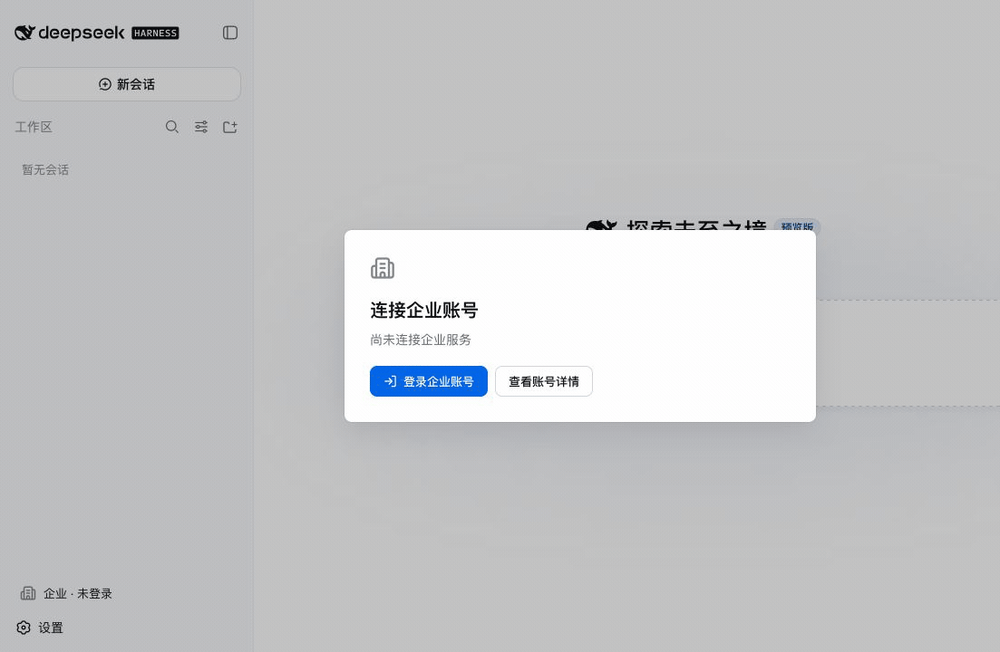

# T07 员工登录 UI 验收记录

状态：`completed`

验收日期：2026-08-18（Asia/Shanghai）

## 结论

T07 已完成，且没有进入 T08。员工账号界面完全建立在锁定 Harness 的公开 Client 扩展点上：
`settings.section` 承载企业账号页，`sidebar.footer.action` 显示并刷新连接状态，
`settings.onboarding` 在未登录时引导登录并通过 owner 公开的 `openSection('enterprise')` 进入详情。
实现没有查询 Harness DOM、修改私有 React 状态或扩展 Typert Remote。

本产品把 Harness 定位为桌面员工工作台。本次真实浏览器验收固定为 1280x720；官方桌面 Settings
shell 在移动宽度下的布局不属于 T07，也没有为未公开的移动契约增加补偿对话框。未来移动端由独立
产品入口承载认证和交互，不与桌面插件内部导航耦合。

## 核心实现

- `EnterpriseAccountStore` 是三个 slot 的单一状态源，首个订阅者建立 SSE，最后一个订阅者退出时
  关闭 EventSource 与请求 lifetime；登录、取消、退出动作串行执行。
- 浏览器 API 只能访问固定同源 `/enterprise/api/v1/local/*` 路径。三个动作严格发送
  `application/json` 的 `{}`，调用方不能注入平台 origin 或 `Authorization`。
- status 严格解码十种连接状态和脱敏字段，未知字段会失败；bootstrap 只向 UI 投影用户与设备，
  模型、配额、插件和 Session policy 不进入账号 snapshot。
- READY/REFRESHING 才读取 bootstrap；认证过期、设备撤销、取消、退出和重新登录都会清除旧账号事实。
- 所有错误使用稳定 code 映射固定中文文案，不显示服务端 message。footer 只有官方公开的 `wide`
  owner 参数，因此只负责状态与刷新；账号页导航归 Harness Settings 自己所有。
- bundle 的 Client graph 只新增官方 `@deepseek-ai/dsh-client-ui-settings-general`，React、图标和账号逻辑
  继续打入 lazy-CJS Client factory，没有新增运行时 package 安装或 ambient shim。

## 状态与浏览器验收

十态呈现固定覆盖 `SIGNED_OUT`、`AUTHORIZING`、`ENROLLING`、`BOOTSTRAPPING`、`READY`、
`CANCELLED`、`FAILED`、`REFRESHING`、`AUTH_EXPIRED` 和 `DEVICE_REVOKED`。真实流程使用本任务的
`scripts/t07-browser-harness.mjs` 启动可控回环假平台、临时 `DSH_HOME` 和未修改的锁定 Harness
`web` profile；假平台只存在于验收进程，发行 bundle 仍要求 HTTPS。



六张原始无密钥快照分别为：

1. [`SIGNED_OUT`](assets/t07-01-signed-out.png)：企业 onboarding 与 sidebar 未登录状态。
2. [`AUTHORIZING`](assets/t07-02-authorizing.png)：系统浏览器授权等待与可取消动作。
3. [`CANCELLED`](assets/t07-03-cancelled.png)：稳定错误 `ENT_AUTH_CANCELLED` 与重新登录。
4. [`READY`](assets/t07-04-ready.png)：官方“设置 → 企业 → 账号”中的用户、设备与连接事实。
5. [`AUTH_EXPIRED`](assets/t07-05-auth-expired.png)：SSE 切换至 `ENT_AUTH_SESSION_EXPIRED`。
6. [`DEVICE_REVOKED`](assets/t07-06-device-revoked.png)：重新登录后 SSE 切换至 `ENT_DEVICE_REVOKED`。

官方 DeepSeek API Key onboarding 在企业登录完成后仍正常出现，证明企业 onboarding 没有破坏 Harness
原有步骤；验收通过“稍后配置”关闭它，不输入任何模型 Key。账号页、错误文案和动作按钮在
1280x720 下均完整可见，无裁切、横向溢出或不连贯重叠。

## 自动验收

受影响 package 定点门禁：

```sh
corepack pnpm@11.7.0 --filter @enterprise-agent/dsh-ui test
corepack pnpm@11.7.0 --filter @enterprise-agent/dsh-ui typecheck
corepack pnpm@11.7.0 --filter @enterprise-agent/dsh-platform-client test
corepack pnpm@11.7.0 --filter @enterprise-agent/dsh-bundle test
```

结果：UI 3 个文件 7 项、platform-client 4 个文件 18 项、bundle 3 项全部通过。测试覆盖十态严格
解码、未知/Token 形态状态字段拒绝、固定同源路径、空对象动作、SSE 生命周期、共享 store、动作
串行、READY bootstrap、稳定错误投影和三个官方 slot 的注册顺序/共享注入。

插件 workspace 完整门禁：

```sh
corepack pnpm@11.7.0 run check
```

结果：生成无漂移，6 个 package 的 typecheck/build、全部 package 测试和 workspace 不变量均通过。

## 真实包与锁定 Harness

bundle 重新打包后先通过现有 package consumer/组合 smoke，再由 T07 载体安装到真实 Harness：

```sh
corepack pnpm@11.7.0 run pack:platform-client
corepack pnpm@11.7.0 run smoke:platform-client
corepack pnpm@11.7.0 run pack:bundle
node scripts/t01-harness-smoke.mjs \
  --tgz ../artifacts/enterprise-agent-dsh-bundle-0.1.0.tgz
corepack pnpm@11.7.0 run accept:t07-browser -- \
  --tgz ../artifacts/enterprise-agent-dsh-bundle-0.1.0.tgz
```

真实 Client factory 从 Harness 官方 seed 解析 `react` 与 `react/jsx-runtime`，发现 Settings、sidebar、
onboarding 三个 slot；本地 status/SSE、Session seed 和 installation smoke 继续通过。T07 载体退出时
关闭 Harness/假平台、删除临时 `DSH_HOME`，并再次断言上游工作区为空。

## 安全与边界门禁

```sh
./scripts/bootstrap-harness.sh --check-only
node scripts/upstream-baseline.mjs verify
git diff --check
```

三项均通过。浏览器 DTO、截图、GIF 与本任务 diff 的敏感字段扫描没有发现真实 Token、API Key、
OIDC/LDAP secret 或生产数据。同级 `deepseek-harness` 保持 detached HEAD
`47f943859bef60e4160492346772ded9b24f765a` 且工作区干净，本任务没有修改任何 Harness 文件。

## 任务边界

T08 可以在独立后续任务实现模型/provider/grant/default 与 bootstrap 模型部分。T07 没有提前实现
模型管理、配额、模型网关、插件分发、Session 同步或移动端页面；详细设计中的 T08-T23 仍为
`pending`。
